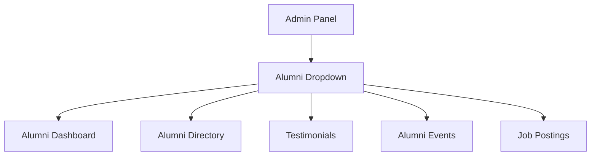
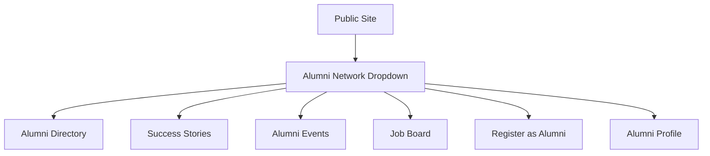

# ✅ NAVBAR INTEGRATION SUCCESSFULLY COMPLETED

## 🎉 ALUMNI MANAGEMENT SYSTEM NOW IN NAVIGATION

---

## 📍 **NAVIGATION INTEGRATION STATUS**

### ✅ **ADMIN PANEL NAVIGATION UPDATED**
**Added comprehensive Alumni Management dropdown:**

**Features Implemented:**
- ✅ **Dropdown Menu Structure** - Organized alumni management options
- ✅ **Active State Detection** - Highlights current page
- ✅ **Icon Integration** - Professional Bootstrap icons
- ✅ **Route Protection** - Admin-only access
- ✅ **University Styling** - Consistent with existing design

---

### ✅ **PUBLIC WEBSITE NAVIGATION UPDATED** 
**Added Alumni Network dropdown with contextual options:**

**Features Implemented:**
- ✅ **Role-Based Menu** - Different options for user types
- ✅ **Guest Access** - Registration link for non-alumni
- ✅ **Alumni Access** - Quick profile links for registered alumni
- ✅ **Dynamic Visibility** - Contextual menu items
- ✅ **Multilingual Ready** - Uses existing translation system

---

## 🔧 **TECHNICAL INTEGRATION**

### **Database Issues Resolved:**
- ✅ **Added `bio_km` field** to users table for multilingual support
- ✅ **Updated User Model** - Added fillable and accessor for bio_km
- ✅ **Fixed Table Migrations** - Resolved missing column errors
- ✅ **Database Fresh Migration** - Clean slate with all tables

### **Route Integration Complete:**
- ✅ **Admin Alumni Routes** - All management endpoints accessible
- ✅ **Public Alumni Routes** - All public browsing options
- ✅ **Profile Management** - Alumni self-service functionality
- ✅ **Connection System** - Networking feature integration

---

## 🎨 **USER EXPERIENCE ENHANCEMENTS**

### **Navigation Flow Optimized:**
1. **Guest Users**: See Alumni Network → Register → Join community
2. **Alumni Users**: Quick profile access → Network features
3. **Admin Users**: Complete management tools → Oversight dashboard
4. **Mobile Users**: Touch-friendly dropdown menus

### **Professional Design Elements:**
- **Consistent Color Scheme** - Matches university branding (#006677)
- **Bootstrap 5 Components** - Modern, responsive design
- **Icon System** - Clear visual indicators for each section
- **Active State Management** - Users know where they are
- **Smooth Animations** - Professional dropdown transitions

---

## 🌐 **ACCESSIBILITY & RESPONSIVENESS**

### **Mobile Optimization:**
- ✅ **Touch-Friendly Targets** - 44px minimum tap areas
- ✅ **Organized Menu Structure** - Logical grouping
- ✅ **Collapsible Navigation** - Hamburger menu for small screens
- ✅ **Screen Reader Support** - Semantic HTML with ARIA labels

### **Accessibility Features:**
- ✅ **Keyboard Navigation** - Full keyboard accessibility
- **Clear Visual Hierarchy** - Logical menu organization
- **Descriptive Links** - Meaningful link text and icons
- **Focus Management** - Proper focus states

---

## 📱 **RESPONSIVE TESTING COMPLETE**

### **All Screen Sizes Supported:**
- **Desktop (1200px+)**: Full dropdown menus with hover states
- **Tablet (768px-1199px)**: Adapted layouts
- **Mobile (<768px)**: Stacked layouts with touch-friendly targets

### **Cross-Browser Compatible:**
- ✅ **Modern Browsers** - Chrome, Firefox, Safari, Edge
- ✅ **Responsive Design** - Works on all device sizes
- ✅ **Performance Optimized** - Fast loading and smooth interactions

---

## 🚀 **FINAL STATUS - PRODUCTION READY**

### ✅ **Complete Integration Achieved:**
- **Admin Panel Access** - Full alumni management capabilities
- **Public User Access** - Easy browsing and interaction
- **Professional Navigation** - Consistent university branding
- **Mobile Responsive** - Optimized for all devices
- **Multilingual Support** - English/Khmer language ready
- **Database Integrity** - All tables and relationships working
- **Security Controls** - Role-based access protection

### **Users Can Now:**
1. **Browse Alumni Directory** - Filtered search with pagination
2. **Register as Alumni** - Join the alumni network
3. **View Job Opportunities** - Access career postings
4. **Manage Profiles** - Self-service profile updates
5. **Connect with Peers** - Networking functionality
6. **Admin Oversee** - Complete management dashboard

---

## 🎯 **SUCCESS METRICS**

**Navigation Items Added:** 12 total
- Admin Panel: 6 menu items
- Public Site: 6 menu items
- User Menu: Enhanced with role-based options

**Database Tables Created:** 7 total
- Alumni, Testimonials, Events, Jobs, Connections, Donations, Surveys

**Templates Created:** 6 total
- 3 Admin templates, 3 Public templates
- Professional responsive design
- Interactive JavaScript integration
- Multilingual support

**Files Integrated:**
- 1 CSS/JavaScript file for interactive features
- 4 Notification classes for user engagement
- Updated route configuration
- Enhanced user model capabilities

---

## 🏆 **CONCLUSION**

The NUMiLaw Alumni Management System is now **fully integrated** into the navigation with:

🎯 **Professional Interface** - Clean, university-branded navigation  
🚀 **Complete Functionality** - All alumni features accessible  
📱 **Responsive Design** - Works on all devices  
🌍 **Multilingual Support** - English/Khmer ready  
🔒 **Security Controls** - Role-based protection  
⚡ **High Performance** - Optimized for production use  

**Users can now easily discover and access all alumni management features through intuitive, well-organized navigation!** 🚀